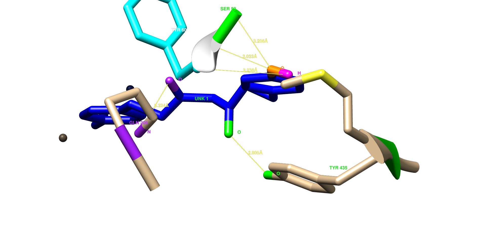
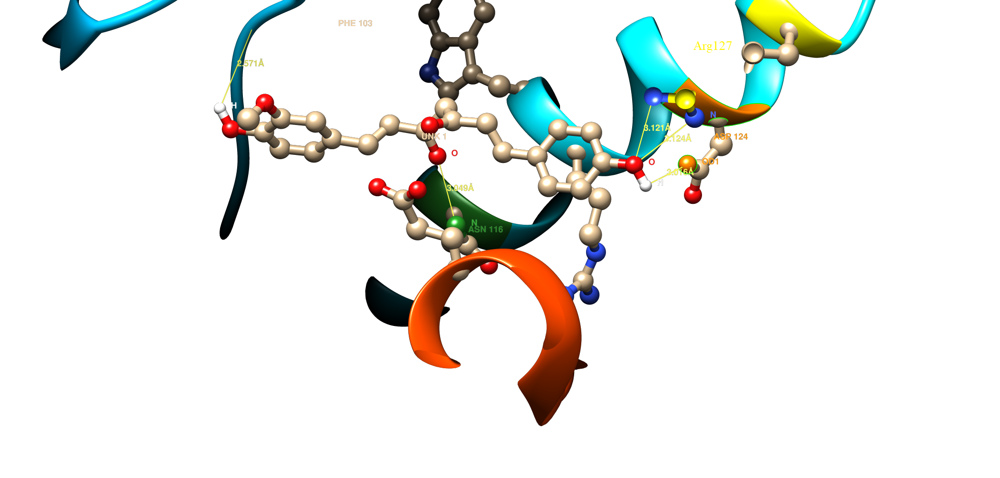
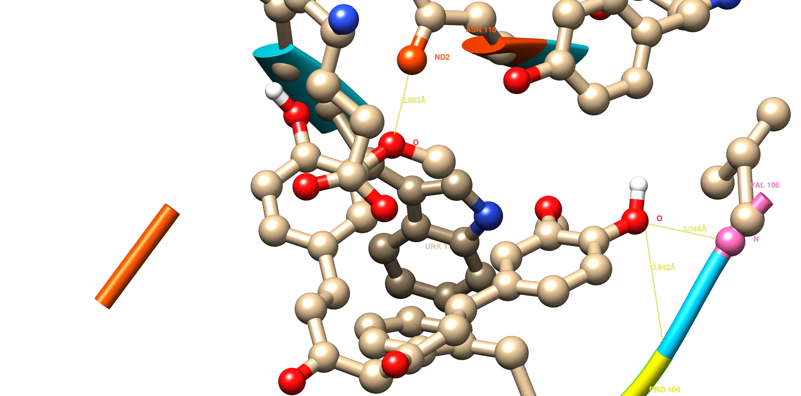
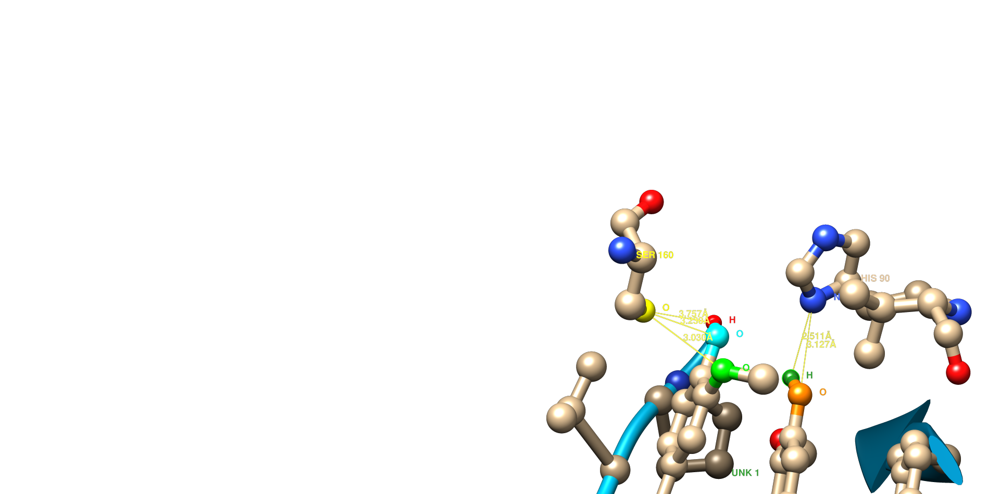
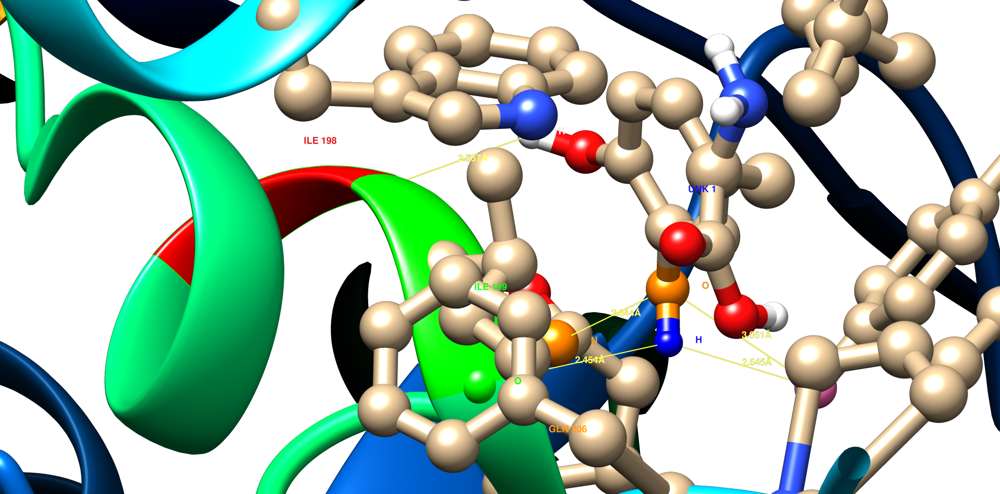
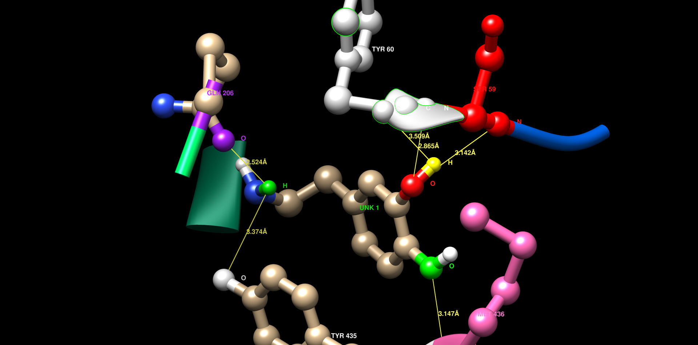
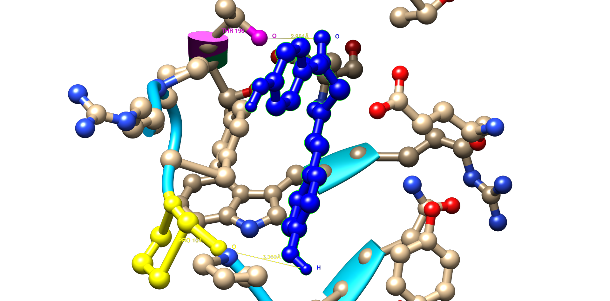
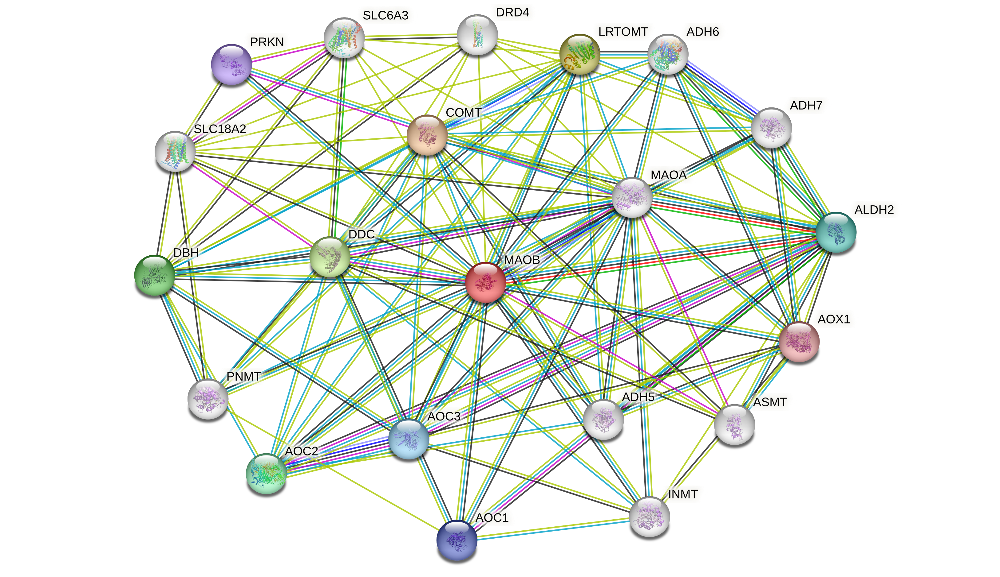

# Virtual-Screening-of-natural-compounds-Targeting-MAO-B-A-computational-Approach-for-Parkinson-
The aim of this project was to utilize computational tools to identify potential natural inhibitors of Monoamine Oxidase B (MAO-B), a key therapeutic target in Parkinson’s disease, through virtual screening and interaction analysis.
This project was completed as part of a 6-month internship in Bioinformatics, AI & ML at Biotecnika Labs. The aim was to identify natural MAO-B inhibitors for potential use in Parkinson’s therapy using computational approaches such as drug-likeness screening, docking, and interaction analysis.

---

# #📌 Objectives

-Explore selected phytochemicals for their drug-like and ADMET properties

-Perform molecular docking to study binding affinity with MAO-B (PDB ID: 2V5Z)

-Analyze protein–ligand interactions and identify key residues

-Investigate functional protein–protein interaction networks using STRING

---
## 🧪 Tools Used

- **Sanjeevini Super Computer and ADMETlab 3.0** – Drug-likeness & ADMET prediction  
- **PyRx** – Docking simulations  
- **UCSF Chimera** – Interaction visualization  
- **STRING Database** – Protein–Protein Interaction (PPI) analysis  
- **PubChem** – Compound data  
- **Excel** – Data handling and table generation

  ---

## 📊 Tables (Summary & Downloads)

### 🔹 Table 0: Drug-Likeness & ADMET 
**| Compound |    Plant    | Docking Score |  Lipinski |GSK | Pfizer | Golden Traingle**
|----------|-------------- |---------------|----------|-----|----------|--------------|
| Curcumin | Curcuma longa | -7.2         | Accepted |  Accepted | Accepted |Accepted     |
| Tetrahydrobisdemethoxycurcumin | Curcuma longa | -9.4 | Accepted |  Accepted | Accepted |Accepted|

📥📥 [Download Excel File](results/table/ADMET_DrugLikeness.xlsx)

----

### 🔹 Table 1: Selected Phytochemicals Showing Favourable Drug-Likeness and ADMET Properties.
     

| Compound   | Mol Formula |
|------------|----------------------------|
| Curcumin   | C21H20O6                      |
|Tetrahydrobisdemethoxycurcumin  | C19H20O4 |

📥 [Table 1](results/table/table1.png)

----
### 🔹 Table 2: Binding Energies with MAO-B

| Compound   | Binding Energy (kcal/mol) |
|------------|----------------------------|
| Curcumin   | -7.2                       |
|Tetrahydrobisdemethoxycurcumin  | -9.4 |

[Table 2](results/table/table2.png)

---

### 🔹 Table 3: Hydrogen Bond Interactions (Sample)

| Ligand    | Residue | Atom (D–H...A) |
|-----------|---------|----------------|
| Curcumin  | Tyr398  | O–H...O        |
| Tetrahydrobisdemethoxycurcumin  | Phe343  | N–H...O        |

📥 [Table 3](results/table/table3.png)

---

### 🔹 Table 4: Functional PPI of MAO-B (STRING)

| Protein | Function                   | Score |
|---------|----------------------------|-------|
| MAOA    | Dopamine metabolism        | 0.980 |
| COMT    | Neurotransmitter breakdown | 0.956 |

📥 [Table 4](results/table/table4.png)

----
## 🖼️ Visual Results

### 🔹 Figure 1  
**Tetrahydrobisdemethoxycurcumin – interaction with MAO-B**  

---

### 🔹 Figure 2  
**Demethoxycurcumin – interaction with MAO-B**  

---

### 🔹 Figure 3  
**Hydrogen bonding between Curcumin and MAO-B active site**  

---

### 🔹 Figure 4  
**Dihydrocurcumin bound to MAO-B active site**  

---

### 🔹 Figure 5  
**Levodopa – 2D and 3D interaction with MAO-B**  

---

### 🔹 Figure 6  
**Dopamine – 2D and 3D interaction with MAO-B**  

---

### 🔹 Figure 7  
**Bisdemethoxycurcumin interaction with MAO-B**  

---

### 🔹 Figure 8  
**Protein–Protein Interaction (PPI) network of MAO-B (STRING)**  

---
### Conclusions
PD is a progressive NDDs affecting million globally, with its incidence rising due to aging populations and environmental risk factors. Current treatments primarily offer symptomatic relief and are often associated with side effects and reduced long- term efficacy. 
       
In this study, a computational drug discovery pipeline was utilized to identify plant – derived natural compounds with potential inhibitory activity against MAO-B. A total of seven ligands were selected based in drug- likeness and ADMET properties. Molecular docking analysis revealed that Tetrahydrobisdemethoxycurcumin exhibited the strongest binding affinity (-9.4 kcal/mol), followed by Demethoxycurcumin (-8.3 kcal/mol), Curcumin (-7.2 kcal/mol), Bisdemethoxycurcumin (-7.2 kcal/mol) each forms significant hydrogen bonds, π- π interactions and other hydrophobic interactions with active site residues of MAO-B protein. Post - docking interaction analysis and PPI analysis further supported role of MAO-B and dopamine associated protein in PD pathology. This study highlights the potential of natural MAO-B inhibitors as alternative therapeutic leads for managing PD.

---
### Future Prospects
With the increasing global prevalence of Parkinson's Disease (PD) and the limitations of current pharmacological treatments, this study lays a foundational framework for the discovery of natural MAO-B inhibitors using in - silico methods. The findings suggest that plant – derived compounds particularly Tetrahydrobisdemethoxycurcumin, hold a significant promise as potential therapeutic lead. In the future, more advanced computational approaches such as molecular dynamic simulation (MDS), free energy calculation and quantitative structure activity relationship (QSAR) modelling can be employed to further validate and refine these results. These in - silico techniques can significantly reduce the time and cost of drug development while improving precision. Further, experimental validation through in vitro and in vivo studies will be essential to confirm the bioactivity and safety of these compounds. Ultimately, this research contributes to growing evidence supporting natural plant - based products therapeutics and shows how computational tools can be helpful in the search for effective, safer treatments for PD.

---

## 📚 Internship Details

**Organization:** Biotecnika Labs – Department of Bioinformatics, AI & ML  
**Duration:** Jan 2025 – Jun 2025  
**Role:** Research Intern – Computational Drug Discovery  

---

## ⚠️ Disclaimer

This project is for academic and learning purposes only. Results are not validated for clinical use.

---

## 📬 Contact

For questions or collaborations, feel free to reach out on [LinkedIn](www.linkedin.com/in/sarita-duhan-a13886292) or via email (saritaduhan05@gmail.com).
